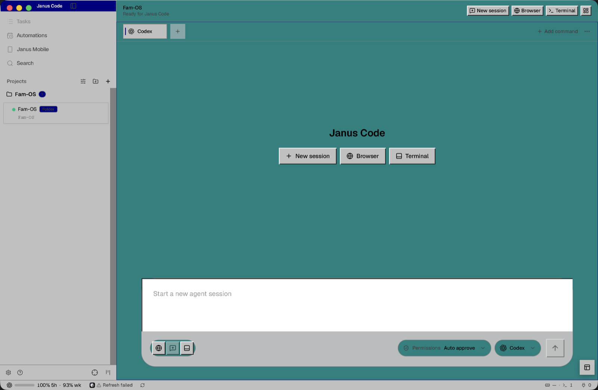
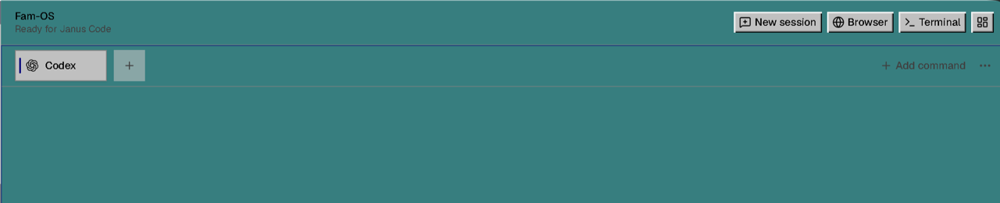
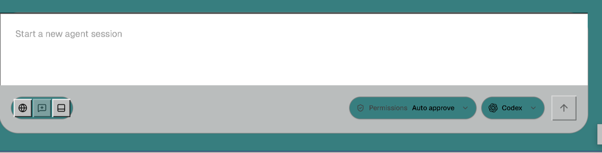
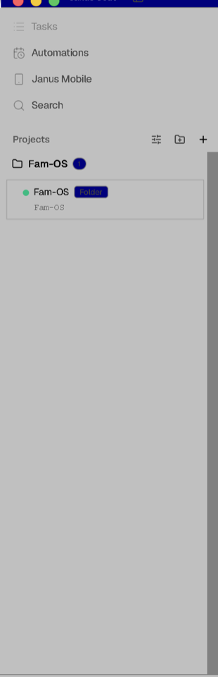

<h1 align="center">
   Janus Code
</h1>

  
  
  
  

  <a href="docs/readme/README.es.md">Español</a> · <a href="docs/readme/README.zh-CN.md">中文</a> · <a href="docs/readme/README.ja.md">日本語</a> · <a href="docs/readme/README.ko.md">한국어</a>

  <strong>A retro desktop workbench for modern coding agents.</strong> 
  Janus Code wraps terminal-native agents in a tactile GUI with browser-style panes, project worktrees, model controls, and annotation-aware browser context.

<h3 align="center"><a href="https://github.com/jakedomshoots/janus-code/releases/latest"><ins>Download Janus Code</ins></a></h3>

  

## The Janus Code Interface

Janus Code is built around the idea of beginnings and endings. The default
interface starts with Retro 95: early desktop software, sharp edges, explicit
controls, and fast tactile feedback. The alternative Modern themes keep the
current polished Janus look available when you want the newer end of the
timeline.

<table>
<tr>
<td width="50%" valign="top">

### Retro 95 by Default

The main workspace now opens in a Windows 95-inspired skin with system-style
bevels, compact controls, classic focus states, and a dense desktop layout made
for repeated coding work.

</td>
<td width="50%" valign="top">

### Modern as the Alternative

Prefer the current Janus styling? Switch to **Modern Auto**, **Modern Dark**, or
**Modern Light** from Appearance settings without changing your projects,
agents, terminals, or browser sessions.

</td>
</tr>
<tr>
<td width="50%" valign="top">

### Browser-Like Agent Tabs

Agent sessions, browser workbench access, terminal tools, and pane controls are
organized like a desktop browser so multiple threads can stay visible without
turning the workspace into a terminal wall.

</td>
<td width="50%" valign="top">

### Composer-First Controls

Provider, model, permission, thinking mode, browser context, and terminal entry
points live around the chat composer, where the agent launch flow actually uses
them.

</td>
</tr>
</table>

## Features

<table>
<tr>
<td width="50%" valign="middle">

### Multi-Agent Workspaces

Run Claude Code, Codex, Gemini, OpenCode, and other CLI agents side by side.
Each session can live in its own isolated git worktree with status, diffs, and
thread state tracked in the desktop UI.

[Docs →](https://github.com/jakedomshoots/janus-code/tree/main/docs)

</td>
<td width="50%">
  
</td>
</tr>
<tr>
<td width="50%" valign="middle">

### Browser-Style Pane Orchestration

Split panes, switch agent threads like tabs, open the browser workbench beside
the conversation, and keep terminal debugging available without making the
terminal the primary interface.

[Docs →](https://github.com/jakedomshoots/janus-code/tree/main/docs)

</td>
<td width="50%">
  
</td>
</tr>
<tr>
<td width="50%" valign="middle">

### Browser Annotation Handoff

Use the embedded Chromium browser to inspect real pages, grab UI elements, add
annotations, and attach that browser context directly into the next agent
message.

[Docs →](https://github.com/jakedomshoots/janus-code/tree/main/docs)

</td>
<td width="50%">
  
</td>
</tr>
<tr>
<td width="50%" valign="middle">

### Provider And Model Controls

Pick the provider, model, permission level, and thinking mode from the composer
surface so the GUI launch path and the underlying CLI agent stay in sync.

[Docs →](https://github.com/jakedomshoots/janus-code/tree/main/docs)

</td>
<td width="50%">
  
</td>
</tr>
<tr>
<td width="50%" valign="middle">

### GitHub, Linear, And Repo Context

Browse PRs, issues, project boards, source control state, diffs, repo previews,
and task context in-app before handing work to an agent.

[Docs →](https://github.com/jakedomshoots/janus-code/tree/main/docs)

</td>
<td width="50%">
  
</td>
</tr>
<tr>
<td width="50%" valign="middle">

### Review AI Diffs

Drop comments on any diff line and ship them back to the agent — review, edit, and commit without leaving Janus Code.

[Docs →](https://github.com/jakedomshoots/janus-code/tree/main/docs)

</td>
<td width="50%">
  
</td>
</tr>
<tr>
<td width="50%" valign="middle">

### Files, Images, And Markdown

Preview Markdown, images, PDFs, and repo docs. Drag files or images straight
into an agent prompt when the task needs local context.

[Docs →](https://github.com/jakedomshoots/janus-code/tree/main/docs)

</td>
<td width="50%">
  
</td>
</tr>
<tr>
<td width="50%" valign="middle">

### Janus CLI And Automation

Agents can drive Janus Code too. Script workflows with the primary `janus` CLI for workspace, terminal, browser, and progress automation.

[Docs →](https://github.com/jakedomshoots/janus-code/tree/main/docs)

</td>
<td width="50%">
  
</td>
</tr>
</table>

**Also in the box:**

- **[Retro/Modern Appearance](https://github.com/jakedomshoots/janus-code/tree/main/docs)** — Start in Retro 95, switch to Modern Auto/Dark/Light when you want the newer Janus surface.
- **[Quick open](https://github.com/jakedomshoots/janus-code/tree/main/docs)** — Search across worktrees, files, agents, commands, and repo context without leaving your flow.
- **[Account switcher &amp; usage tracking](https://github.com/jakedomshoots/janus-code/tree/main/docs)** — See Claude and Codex usage and rate-limit resets, and hot-swap accounts without re-logging in.
- **[Computer Use](https://github.com/jakedomshoots/janus-code/tree/main/docs)** — Let agents operate desktop apps and visible UI when a workflow needs real interaction.
- **[Notifications and unread state](https://github.com/jakedomshoots/janus-code/tree/main/docs)** — Know when an agent finishes or needs attention, then mark threads unread to come back later.
- **And many, many more** — the [changelog](https://github.com/jakedomshoots/janus-code/releases) is the real feature list.

---

## Supported Agents

Works with **any CLI agent** — if it runs in a terminal, it runs in Janus Code.

  <a href="https://docs.anthropic.com/claude/docs/claude-code"><kbd> Claude Code</kbd></a> &nbsp;
  <a href="https://github.com/openai/codex"><kbd> Codex</kbd></a> &nbsp;
  <a href="https://x.ai/cli"><kbd> Grok</kbd></a> &nbsp;
  <a href="https://github.com/google-gemini/gemini-cli"><kbd> Gemini</kbd></a> &nbsp;
  <a href="https://cursor.com/cli"><kbd> Cursor</kbd></a> &nbsp;
  <a href="https://docs.github.com/en/copilot/how-tos/set-up/install-copilot-cli"><kbd> GitHub Copilot</kbd></a> &nbsp;
  <a href="https://opencode.ai/docs/cli/"><kbd> OpenCode</kbd></a> &nbsp;
  <a href="https://ampcode.com/manual#install"><kbd> Amp</kbd></a> &nbsp;
  <a href="https://openclaude.gitlawb.com/"><kbd> OpenClaude</kbd></a> &nbsp;
  <a href="https://antigravity.google/docs/cli-overview"><kbd> Antigravity</kbd></a> &nbsp;
  <a href="https://pi.dev"><kbd> Pi</kbd></a> &nbsp;
  <a href="https://omp.sh"><kbd> oh-my-pi</kbd></a> &nbsp;
  <a href="https://hermes-agent.nousresearch.com/docs/"><kbd> Hermes Agent</kbd></a> &nbsp;
  <a href="https://devin.ai/cli"><kbd> Devin</kbd></a> &nbsp;
  <a href="https://block.github.io/goose/docs/quickstart/"><kbd> Goose</kbd></a> &nbsp;
  <a href="https://docs.augmentcode.com/cli/overview"><kbd> Auggie</kbd></a> &nbsp;
  <a href="https://github.com/autohandai/code-cli"><kbd> Autohand Code</kbd></a> &nbsp;
  <a href="https://github.com/charmbracelet/crush"><kbd> Charm</kbd></a> &nbsp;
  <a href="https://docs.cline.bot/cline-cli/overview"><kbd> Cline</kbd></a> &nbsp;
  <a href="https://www.codebuff.com/docs/help/quick-start"><kbd> Codebuff</kbd></a> &nbsp;
  <a href="https://commandcode.ai/docs/quickstart"><kbd> Command Code</kbd></a> &nbsp;
  <a href="https://docs.continue.dev/guides/cli"><kbd> Continue</kbd></a> &nbsp;
  <a href="https://docs.factory.ai/cli/getting-started/quickstart"><kbd> Droid</kbd></a> &nbsp;
  <a href="https://kilo.ai/docs/cli"><kbd> Kilocode</kbd></a> &nbsp;
  <a href="https://www.kimi.com/code/docs/en/kimi-code-cli/getting-started.html"><kbd> Kimi</kbd></a> &nbsp;
  <a href="https://kiro.dev/docs/cli/"><kbd> Kiro</kbd></a> &nbsp;
  <a href="https://github.com/mistralai/mistral-vibe"><kbd> Mistral Vibe</kbd></a> &nbsp;
  <a href="https://github.com/QwenLM/qwen-code"><kbd> Qwen Code</kbd></a> &nbsp;
  <a href="https://support.atlassian.com/rovo/docs/install-and-run-rovo-dev-cli-on-your-device/"><kbd> Rovo Dev</kbd></a> &nbsp;
  <kbd>+ any CLI agent</kbd>

---

## Install

### Desktop — macOS, Windows, Linux

Download the latest Janus Code desktop builds directly from GitHub Releases:

- [macOS Apple Silicon](https://github.com/jakedomshoots/janus-code/releases/latest/download/janus-code-macos-arm64.dmg)
- [macOS Intel](https://github.com/jakedomshoots/janus-code/releases/latest/download/janus-code-macos-x64.dmg)
- [Windows](https://github.com/jakedomshoots/janus-code/releases/latest/download/janus-code-windows-setup.exe)
- [Linux AppImage](https://github.com/jakedomshoots/janus-code/releases/latest/download/janus-code-linux.AppImage)

## Community &amp; Support

- **Feedback &amp; Ideas:** Missing something? [Open an issue](https://github.com/jakedomshoots/janus-code/issues).
- **Privacy:** See the [privacy &amp; telemetry docs](https://github.com/jakedomshoots/janus-code/tree/main/docs) for the current telemetry model.
- **Show Support:** [Star](https://github.com/jakedomshoots/janus-code) this repo to follow along.

---

## Developing

Want to contribute or run locally? See our [CONTRIBUTING.md](.github/CONTRIBUTING.md) guide.

## License

Janus Code is free and open source under the [MIT License](LICENSE).

## Attribution

Janus Code includes code originally published under the MIT License. Required
copyright and license notices are preserved in `LICENSE` and `NOTICE.md`.
